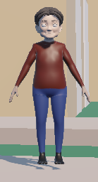
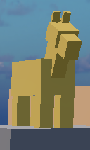
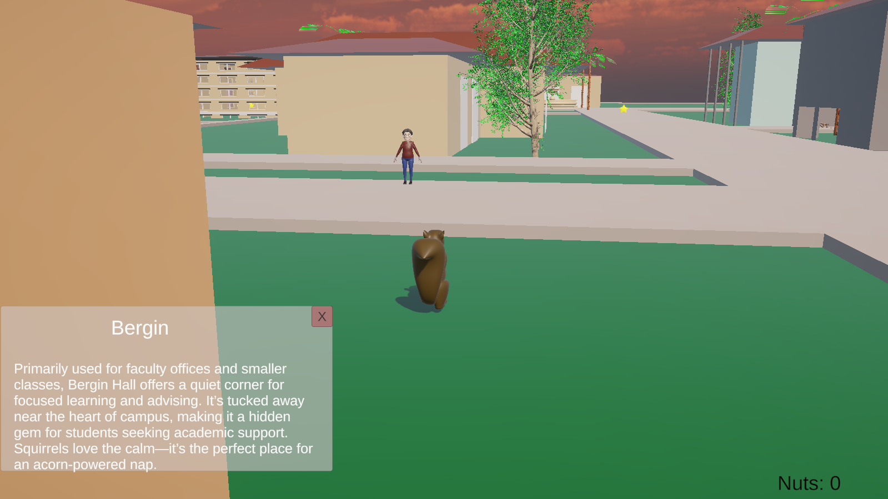
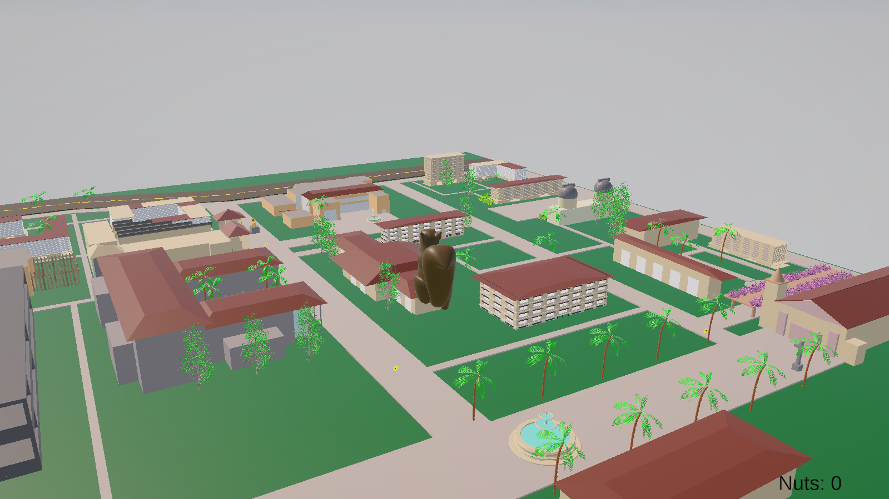
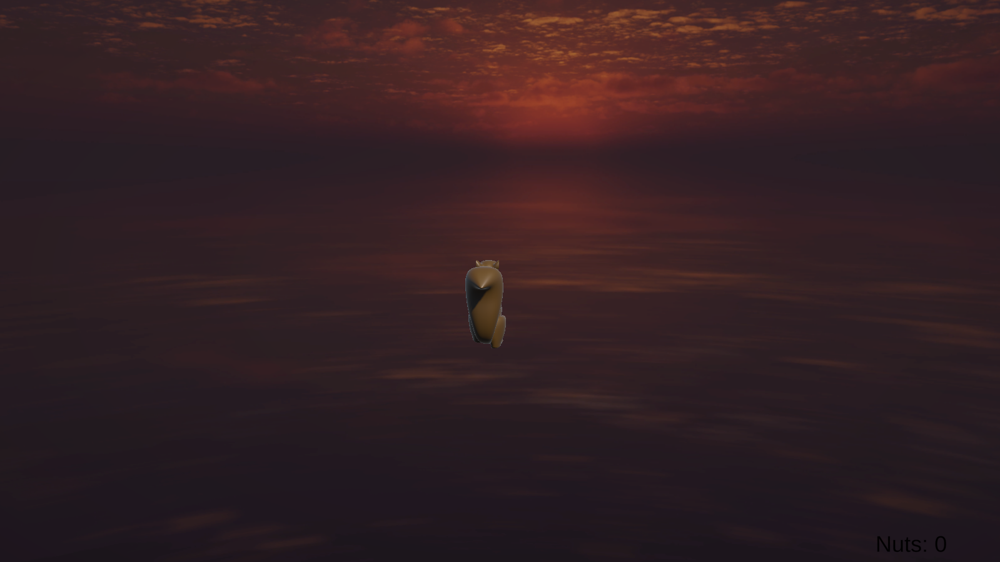
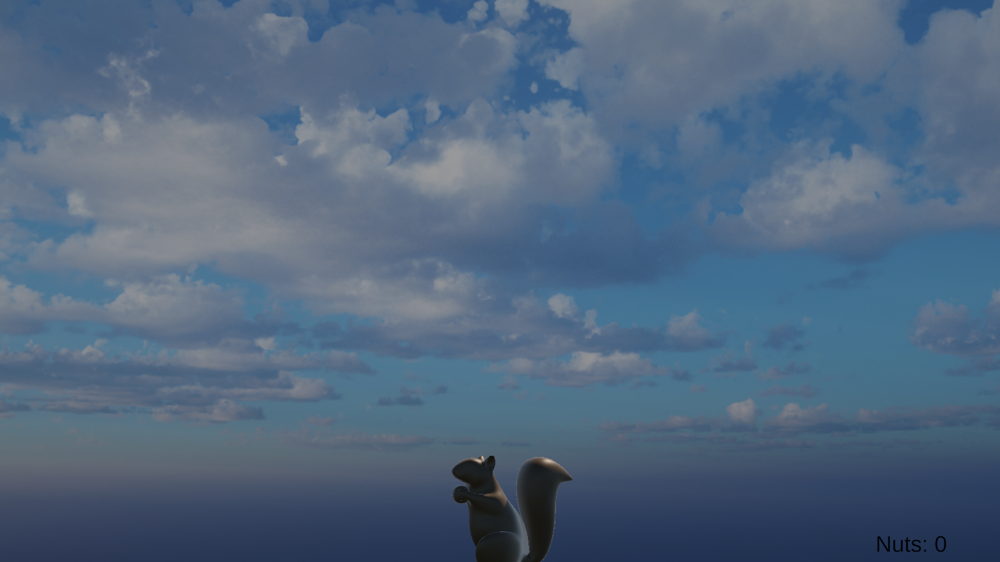
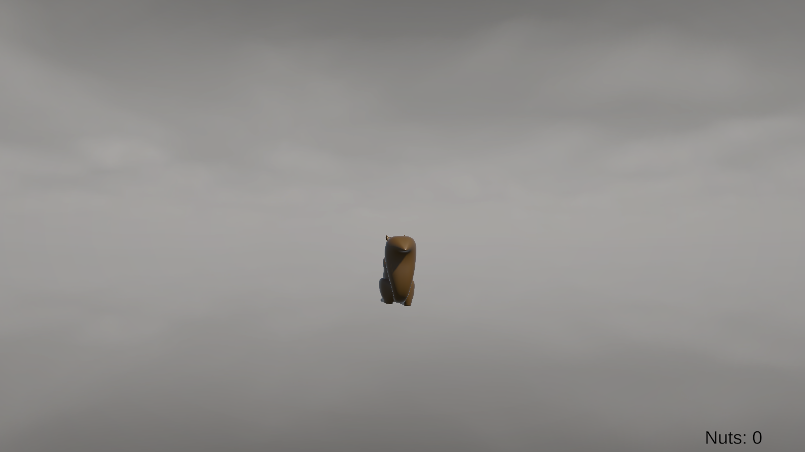
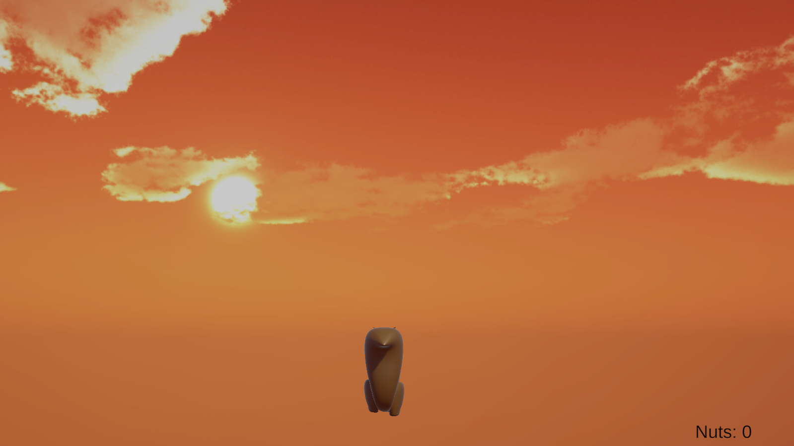
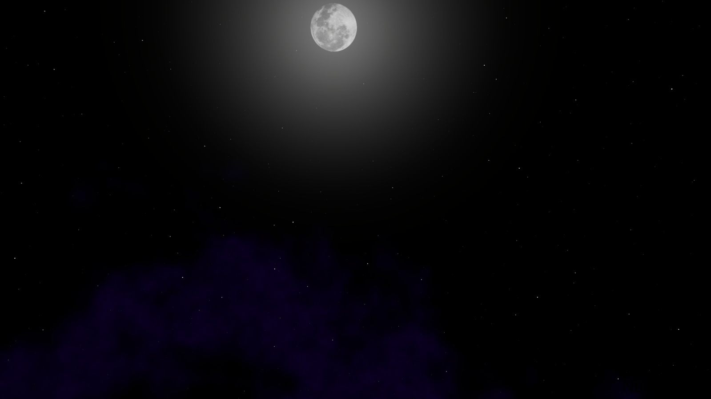
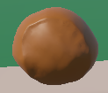

# 🐿️ Squirrel Clara University

*A Unity exploration game built for CSEN 174*

**Developers:** Ally, Hugo, Joseph, Luke

---

## 📂 GitHub Source

This repository contains all Unity source code and assets for the project.
To play the game, download the pre-built version using the link below.

---

## 🎮 Download & Installation

> 🔒 **Note:** You must be signed into a Santa Clara University (SCU) account to access the download link.

➡️ **[Download Game Build (Windows/Mac)](https://drive.google.com/drive/folders/1JYLy-8yQQtKGHU8syXW8pfBpDEwub8Rj?usp=sharing)**
📦 **Uncompressed File Size:** \~587 MB

### 🪟 Windows

* Unzip the downloaded folder before launching the game.
* The Windows version is an `.exe` file located in the `Windows x64` folder.
* Double-click the `Squirrel Clara University 1.0.exe` to launch.

> ⚠️ Do **not** remove or move any files from the downloaded folder. The executable (`Squirrel Clara University 1.0.exe`) depends on all accompanying files to run properly.

### 🍎 macOS

* Unzip the downloaded folder before launching the game.
* The macOS version is a `.app` file.
* You can directly click the `.app` to launch the game.
* The `.app` file is a self-contained application bundle — it does **not** expose any source code or assets, similar to a `.exe` on Windows.
* The macOS version is a `.app` file.
* You can directly click the `.app` to launch the game.

> ⚠️ If you double-click the app and macOS gives an error saying it cannot open the file because it can't verify the developer, open it in Finder, right-click, then select **Open**. macOS will allow it to launch on the second try.

---

## 🧠 System Requirements

* Recommended: Computer with a dedicated GPU
* Input: Best played with a mouse

### Trackpad Tips

If using a trackpad:

* Use a **small area** of the trackpad for better precision

* Keep your finger **lightly lifted and gliding** on the same spot instead of lifting and repositioning repeatedly

* Make **small circular movements** to control the camera smoothly

---
---
---

## 🕹️ Controls & Gameplay

* **Movement:** `W`, `A`, `S`, `D`
* **Jump:** `Space`
* **Look Around:** Mouse
* **Interact:** Hover + `E`
* **Teleport to Scenic Tower:** Press `` ` `` key
* **To exit the game:** Press `Alt` + `F4`

---

## 🌟 Features

### NPC: Julie Sullivan

Hover and press `E` to trigger interactive dialogue.

---

### Power Star

Temporary speed boost (10s) when collected.

---

### Beer

Temporarily inverts movement and flashes the screen black (20s).

---

### Horse Statue

Switches background music from Animal Crossing to Minecraft.

---

### Interactive Buildings

Most campus buildings include interactive popups (left-click to activate).

---

### Scenic Tower View

Use the backtick (\`) key to teleport to an invisible tower with a full campus view.

---

### Dynamic Day/Night Cycle

Time of day changes every \~40 seconds, cycling through:

* 3 sunrise backgrounds
* 4 daytime backgrounds
* 2 sunset backgrounds
* 3 night backgrounds

---

## 🐞 Known Issues

For a list of known bugs or issues that may occur during gameplay, please refer to [Bugs.txt](./Bugs.txt)

---

## 🌰 Bonus Feature

### Nuts

Fun collectible items placed throughout the campus!

